# Messing with government data using Python

.fx: title-slide middle notitle

# Messing with government data using Python

 

    PyCon India 2014
     
    September 27-28, 2014

 
 
 
 

    <a class="author" href="http://openlibrary.org/anand">Anand Chitipothu</a>
     
    <a src="https://twitter.com/anandology">@anandology</a>

---

# During the General Elections 2014...

I volunteered to provide technical assitance to an election campaign in Bangalore (and also in Andhra Pradesh).

---

# And I ended up building...

* A campaign management system
* volunteer signup system
* webapp to find voter details by voterid
* script to format voter lists of a polling center as PDF in compact form
* and other small tittle tools

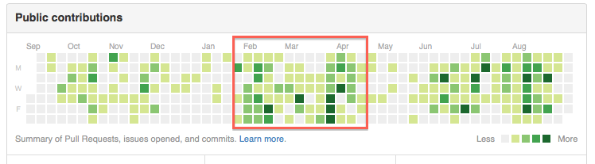

---

# Glossary

* Paliamentary Constituency (*PC25 - Bangalore North*)
* Assembly Constituency (*AC158 - Hebbal*)
* Ward (*W046 - Jayachamarajendra Nagar*)
* Polling Center
	* Typically  a school/govt building containing one or more polling booths
	* E.g. *PX065 - Adarsha Vidya Mandira, R T Nagara*
* Polling Booth
	* E.g. *PB0203 - Adarsha Vidya Mandira, Room No-1*
	* Typically have about 1000 voters
* VoterID
	* unique (supposed to be) identifier for a voter	
* CEO - Chief Electoral Officer
	* <http://www.ceokarnataka.kar.nic.in>
---

# The Challenges

---

## The Campaign Management System

.fx: ol-bg center notitle bottom-title

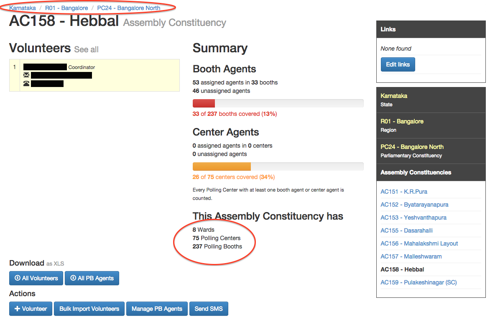

---

## The Campaign Management System

.fx: ol-bg center notitle bottom-title

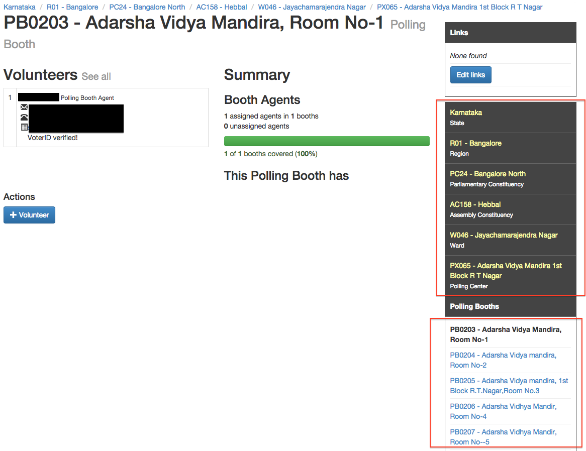

---

## Parliamentaty & Assembly Constituencies

.fx: notitle

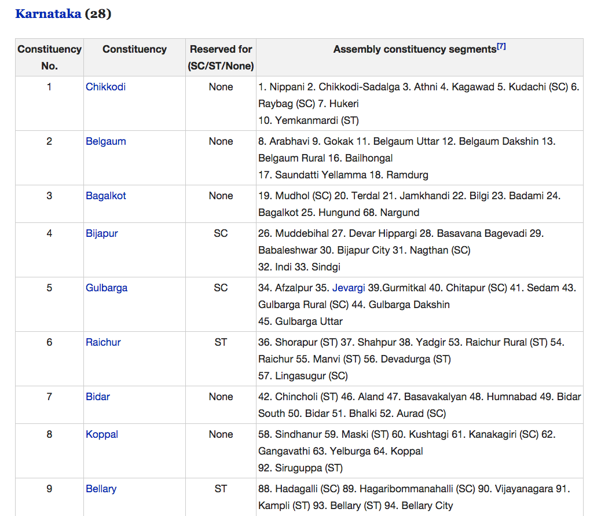

    <h3><a href="https://en.wikipedia.org/wiki/List_of_constituencies_of_the_Lok_Sabha#Karnataka_.2828.29">https://en.wikipedia.org/wiki/List_of_constituencies_of_the_Lok_Sabha</a></h3>

---

## Finding Polling Booths

.fx: notitle

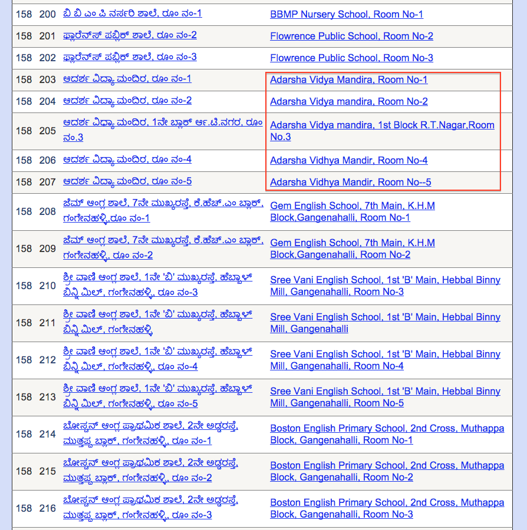

    <h3><a href="http://ceokarnataka.kar.nic.in/ElectionFinalroll2014/Part_List.aspx?ACNO=158">http://ceokarnataka.kar.nic.in/ElectionFinalroll2014/Part_List.aspx?ACNO=158</a></h3>

---

## Finding Ward

.fx: notitle

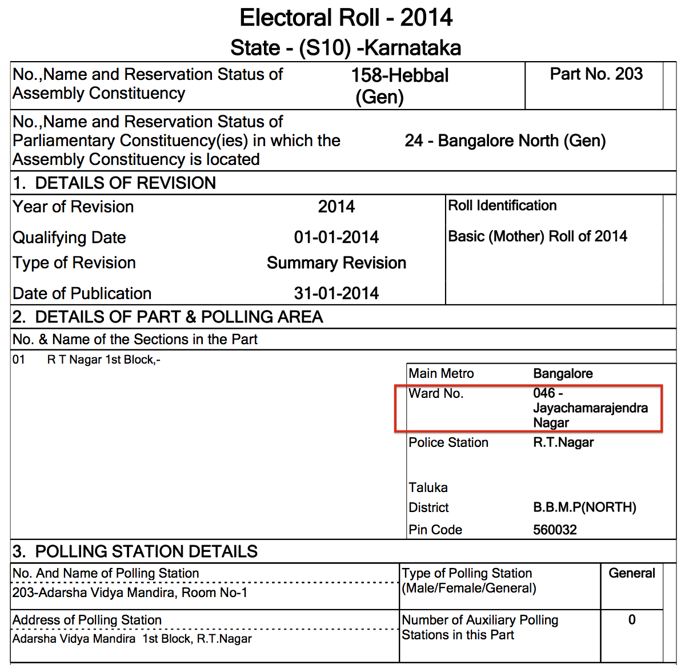

    <h4><a href="http://ceokarnataka.kar.nic.in/ElectionFinalroll2014/PCROLL_2014/English/WOIMG/AC158/AC1580203.pdf">http://ceokarnataka.kar.nic.in/ElectionFinalroll2014/PCROLL_2014/English/WOIMG/AC158/AC1580203.pdf</a></h4>

---

## Volunteer Sign Up System

.fx: ol-bg center notitle bottom-title

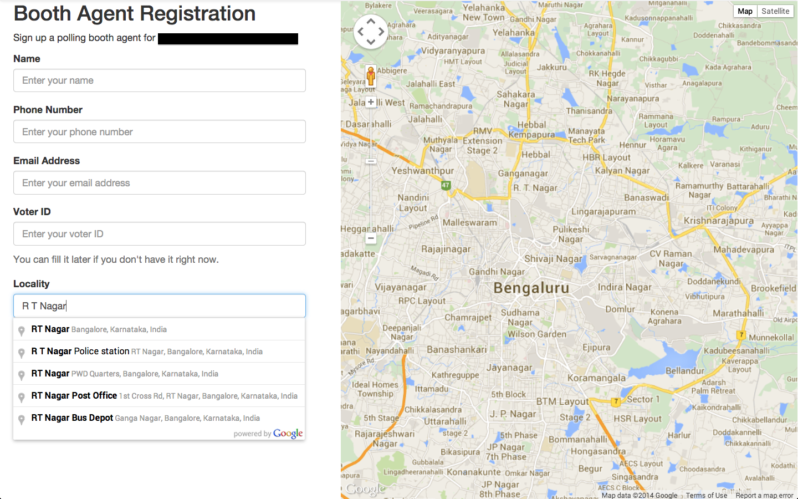

---
## Volunteer Sign Up System

.fx: ol-bg center notitle bottom-title

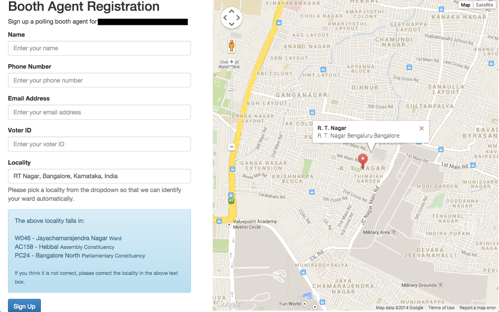

---
## Volunteer Sign Up System

.fx: ol-bg center notitle bottom-title

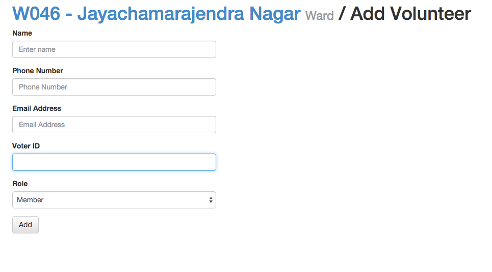

---

## Find Your Polling Booth

.fx: ol-bg center notitle bottom-title

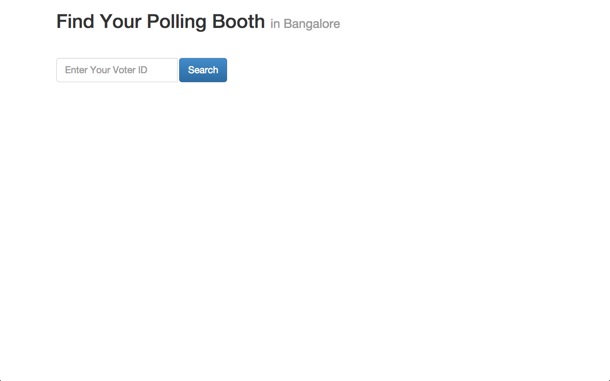

---

## Voter Data

.fx: notitle

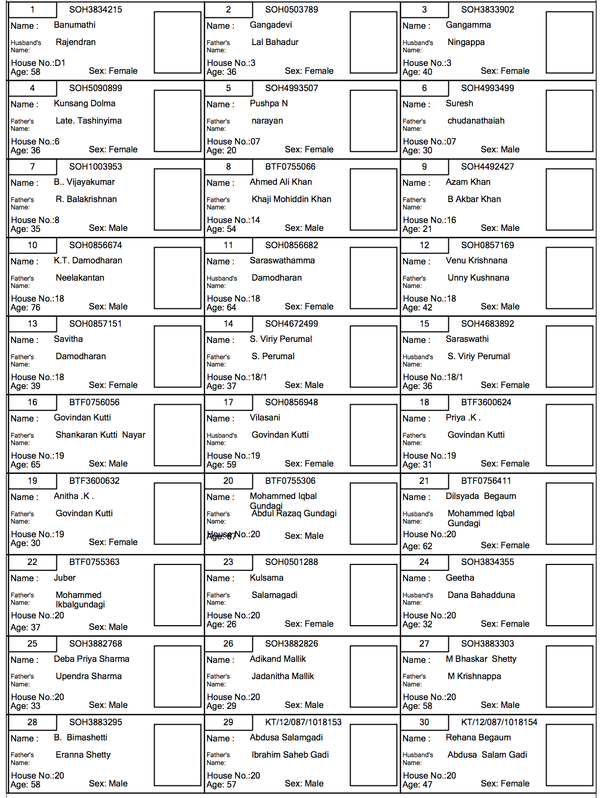

    <h4><a href="http://ceokarnataka.kar.nic.in/ElectionFinalroll2014/PCROLL_2014/English/WOIMG/AC158/AC1580203.pdf">http://ceokarnataka.kar.nic.in/ElectionFinalroll2014/PCROLL_2014/English/WOIMG/AC158/AC1580203.pdf</a></h4>

---

## Compact Voter List

.fx: ol-bg center notitle bottom-title

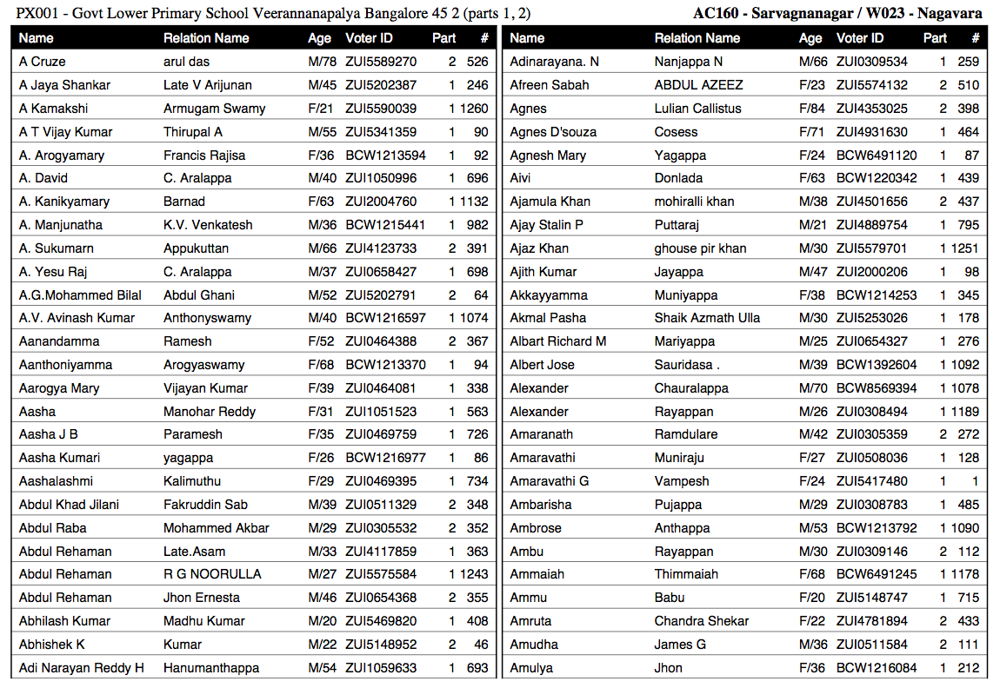

---
## Important Polling Centers 

.fx: ol-bg center notitle bottom-title

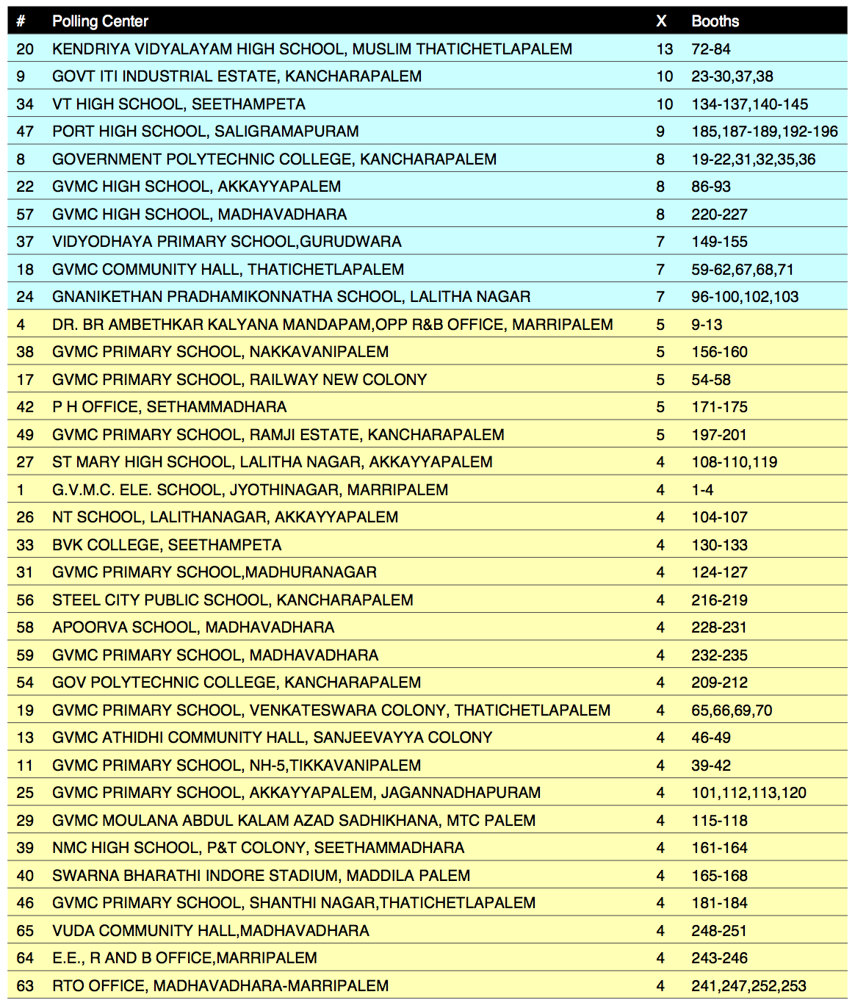

---

# The Fun Part

---

# Parsing HTML pages

* Beautiful Soup is your friend
* Always save intermediate results
* ASP.net is the worth thing ever happened to web

---

## BeautifulSoup

<pre>
from bs4 import BeautifulSoup
import urllib2

def parse(html):
	soup = BeautifulSoup(html)
	
	# find all tds in a table
	rows = soup.select("#ctl00_ContentPlaceHolder1_GridView1 tr")

	# extract text for all rows except the header row
	for tr in rows[1:]:
		tds = tr.find_all("td")
		yield [td.get_text() for td in tr.find_all("td")]

URL = ("http://ceokarnataka.kar.nic.in/ElectionFinalroll2014/" + 
	   "Part_List.aspx?ACNO=158")

html = urllib2.urlopen(URL).read()
data = parse(html)
</pre>

---

## Save Intermediate Results

<pre>
@cache.disk_memoize("cache/wp.html")
def get_wp_page():
    return urllib2.urlopen(WP_URL).read()

@cache.disk_memoize("cache/table_{0}.json")
def get_table_for_state(state):
	...

@cache.disk_memoize("cache/{state_name}_pc.tsv")
def get_pc_list(state_name):
    return [['PC{0:02d}'.format(int(row[0])), row[1].strip()] 
    		for row in get_table_for_state(state_name)]
</pre>
--- 

## The Hell of ASP.net

.fx: ol-bg center

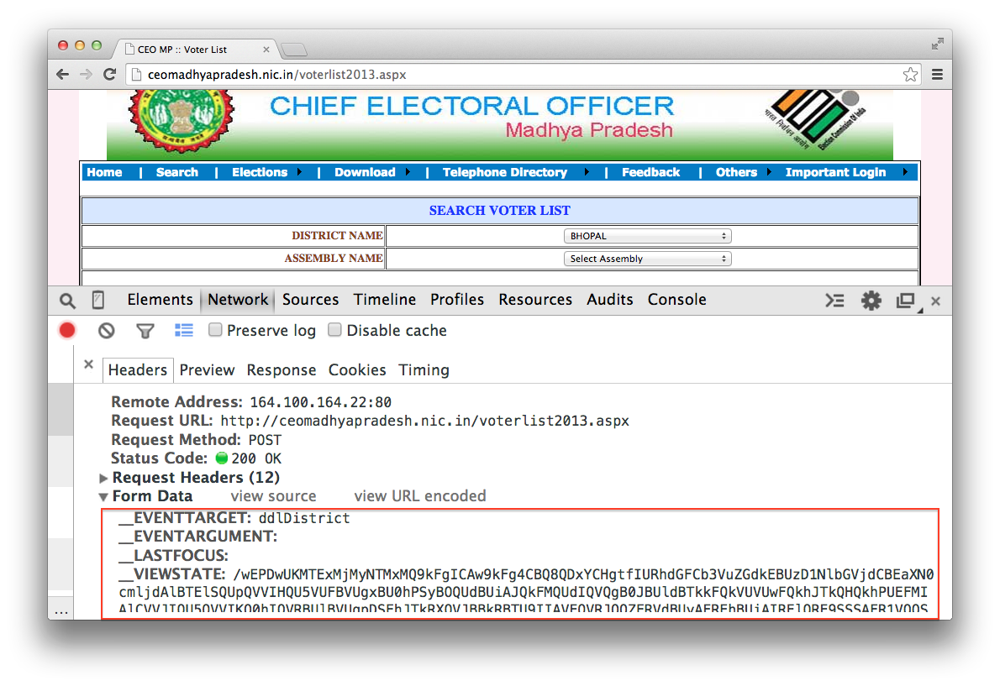

---
## Escaping the Hell of ASP.net

<pre>
@cache.disk_memoize("cache/MP/districts.json")
def get_districts(self):
    return self.browser.get_select_options("ddlDistrict")

@cache.disk_memoize("cache/MP/AC{ac:03d}_booths.tsv")
def get_booths_of_ac(self, dist, ac):
    self.browser.select_option('ddlDistrict', dist)
    self.browser.select_option('ddlAssembly', ac)
    soup = self.browser.get_soup()
    ...
</pre>
---
# Parsing PDFs

.fx: ol-bg center

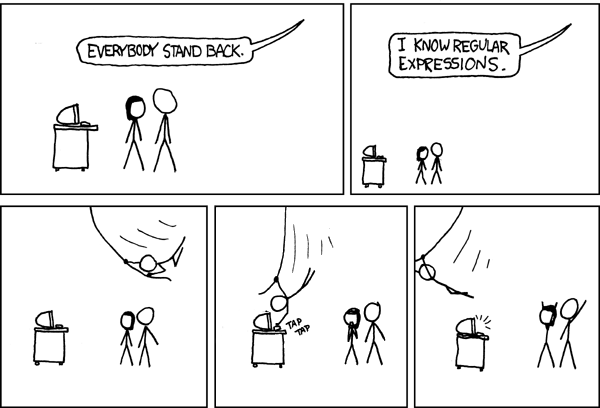

Image derived from <a href="http://xkcd.com/208/">http://xkcd.com/208/</a> 

Creative Commons Attribution-NonCommercial 2.5 License.

---

## PDF to Text

* pdftotext -layout a.pdf a.txt

---

# Formatting Voter Lists

* ReportLab works fine. 
* Beware of performance issues.

---

# Post Elections

I continued to improve the system to make it generic and extendable.

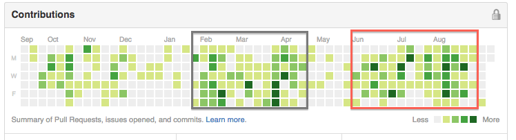
